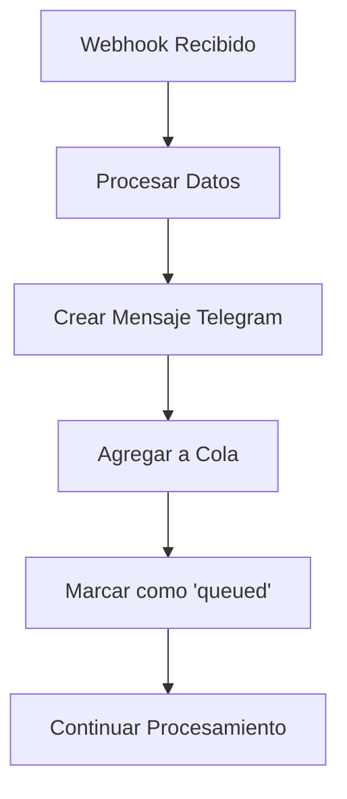
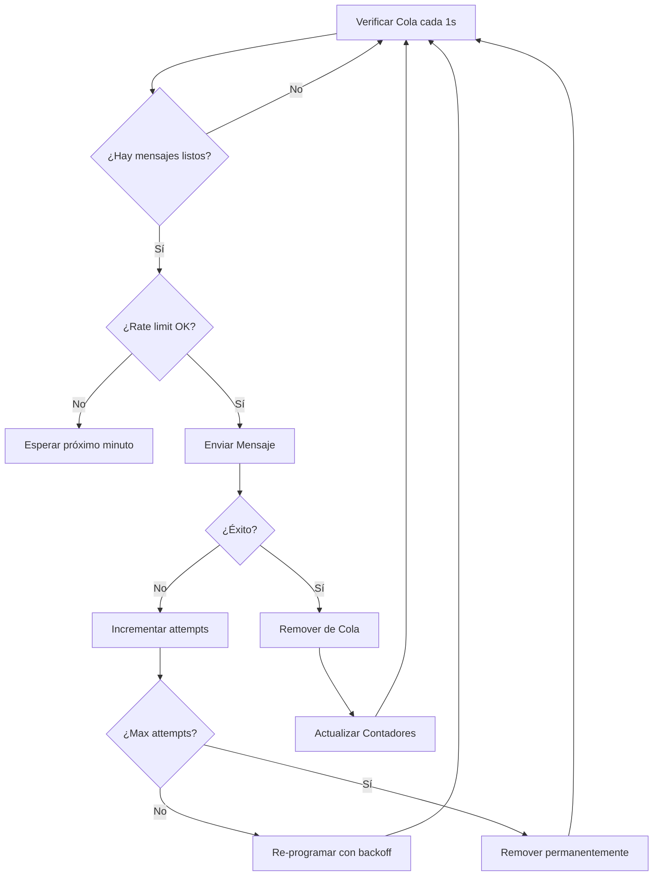

# Sistema de Cola para Telegram - Rate Limiting

## Problema Identificado

El API de Telegram tiene un **rate limit de 20 mensajes por minuto**. Cuando múltiples sistemas usan el mismo bot, esto puede causar errores 429 (Too Many Requests). Por precaución, implementamos un límite de **15 mensajes por minuto**.

## Solución Implementada

### **Sistema de Cola Inteligente**
- **Rate Limiting**: 15 mensajes por minuto máximo
- **Cola FIFO**: Mensajes se procesan en orden de llegada
- **Retry Logic**: Reintentos automáticos con backoff exponencial
- **Scheduling**: Distribución uniforme de mensajes (~4 segundos entre envíos)

## **🔧 Características del Sistema**

### **1. Rate Limiting Automático**
```typescript
const RATE_LIMIT = 15; // 15 mensajes por minuto
const MESSAGE_INTERVAL = 4000; // ~4 segundos entre mensajes
```

### **2. Estados de Mensaje**
- **`queued`**: Mensaje agregado a la cola
- **`sending`**: Mensaje siendo enviado
- **`success`**: Mensaje enviado exitosamente
- **`error`**: Error después de todos los reintentos

### **3. Retry Logic**
- **3 reintentos máximo** por mensaje
- **Backoff exponencial**: 1, 2, 4 minutos entre reintentos
- **Eliminación automática** después de fallar 3 veces

### **4. Programación Inteligente**
- **Distribución uniforme**: Evita ráfagas de mensajes
- **Respeto del rate limit**: Nunca excede 15 mensajes/minuto
- **Reset automático**: Contador se reinicia cada minuto

## **📊 Monitoreo y Estadísticas**

### **Endpoint de Estadísticas**
```bash
GET /api/hotmart/telegram-queue-stats
```

**Respuesta:**
```json
{
  "success": true,
  "data": {
    "stats": {
      "totalPending": 5,
      "readyToSend": 2,
      "waiting": 3,
      "messagesSentThisMinute": 8,
      "rateLimit": 15,
      "nextReset": "2024-01-15T10:31:00.000Z",
      "isProcessing": false
    },
    "queue": [
      {
        "id": "tg_1705315123456_abc123",
        "chatId": "-1001234567890",
        "text": "🎉 Nueva venta confirmada!...",
        "attempts": 0,
        "maxAttempts": 3,
        "createdAt": "2024-01-15T10:30:00.000Z",
        "scheduledAt": "2024-01-15T10:30:04.000Z",
        "metadata": {
          "type": "venta",
          "asesor": "María García",
          "flujo": "COMPRAS"
        }
      }
    ]
  }
}
```

### **Logs Detallados**
```typescript
// Log cuando se agrega mensaje
logger.info('Mensaje agregado a la cola de Telegram', {
  messageId,
  chatId,
  queueSize: this.queue.length,
  scheduledAt: message.scheduledAt,
  webhookLogId
});

// Log cuando se envía exitosamente
logger.info('Mensaje de Telegram enviado exitosamente', {
  messageId: message.id,
  chatId: message.chatId,
  attempts: message.attempts + 1,
  webhookLogId: message.webhookLogId
});
```

## **🔄 Flujo de Procesamiento**

### **1. Recepción de Webhook**


### **2. Procesamiento de Cola**


## **💻 Implementación en el Código**

### **Webhook Processing (Antes)**
```typescript
// ❌ Envío directo (problemático)
const telegramResult = await sendTelegramMessage(ventaMessage);
if (telegramResult.success) {
  telegramStatus = 'success';
} else {
  telegramStatus = 'error';
}
```

### **Webhook Processing (Después)**
```typescript
// ✅ Usando cola (solución)
const messageId = telegramQueue.enqueueMessage(
  ventaMessage.chat_id,
  ventaMessage.text,
  webhookLogId,
  { 
    type: 'venta',
    asesor: asesorAsignado?.NOMBRE || 'SIN CERRADOR',
    flujo 
  }
);

telegramStatus = 'queued';
telegramMessageId = messageId;
```

## **🎯 Beneficios de la Solución**

### **1. Prevención de Rate Limiting**
- **No más errores 429**: Respeta límites de Telegram API
- **Distribución uniforme**: Evita ráfagas que causan bloqueos
- **Múltiples sistemas**: Seguro para uso compartido del bot

### **2. Reliability**
- **Reintentos automáticos**: Manejo inteligente de errores temporales
- **Persistencia**: Los mensajes no se pierden
- **Logging completo**: Trazabilidad total del flujo

### **3. Monitoreo**
- **Estadísticas en tiempo real**: Visibilidad del estado de la cola
- **Métricas de performance**: Tiempos de procesamiento y éxito
- **Debugging facilitado**: Logs detallados para cada mensaje

### **4. Escalabilidad**
- **Fácil ajuste**: Cambio simple del rate limit si es necesario
- **Extensible**: Fácil agregar nuevos tipos de mensaje
- **Maintainable**: Código limpio y bien documentado

## **⚙️ Configuración**

### **Variables de Entorno**
```bash
# Token del bot de Telegram
TELEGRAM_BOT_TOKEN=your_bot_token_here

# Chat ID del grupo (para notificaciones de ventas)
TELEGRAM_GROUP_CHAT_ID=-1001234567890

# Nivel de logging (opcional)
LOG_LEVEL=debug
```

### **Parámetros Ajustables**
```typescript
// En telegramQueueService.ts
private readonly RATE_LIMIT = 15; // Mensajes por minuto
private readonly INTERVAL = 60000; // 1 minuto
private readonly MESSAGE_INTERVAL = 4000; // ~4 segundos entre mensajes
```

## **🧪 Testing**

### **1. Probar Rate Limiting**
```bash
# Enviar múltiples webhooks rápidamente
for i in {1..25}; do
  curl -X POST http://localhost:3001/api/hotmart/webhook \
    -H "Content-Type: application/json" \
    -d '{"event": "PURCHASE_APPROVED", "data": {...}}'
done

# Verificar que solo 15 se procesan por minuto
curl http://localhost:3001/api/hotmart/telegram-queue-stats
```

### **2. Probar Retry Logic**
```bash
# Configurar token inválido temporalmente
# Enviar webhook
# Verificar que se reintenta automáticamente
```

### **3. Verificar Estados en Frontend**
- Ir a WebhookLogs
- Buscar mensajes con estado "QUEUED"
- Verificar que cambian a "SUCCESS" después del envío

## **📈 Métricas y Alertas**

### **Métricas Importantes**
- **Queue Size**: Número de mensajes pendientes
- **Success Rate**: % de mensajes enviados exitosamente
- **Processing Time**: Tiempo desde queue hasta envío
- **Error Rate**: % de mensajes que fallan permanentemente

### **Alertas Recomendadas**
- **Cola muy grande** (>50 mensajes): Posible problema con bot
- **Error rate alto** (>10%): Verificar configuración
- **Mensajes muy antiguos** en cola: Posible bloqueo

## **🔧 Troubleshooting**

### **Problema: Mensajes no se envían**
```bash
# 1. Verificar configuración
curl http://localhost:3001/api/hotmart/config

# 2. Verificar estadísticas de cola
curl http://localhost:3001/api/hotmart/telegram-queue-stats

# 3. Verificar logs
tail -f server/telegram-queue.log
```

### **Problema: Rate limit excedido**
- Reducir `RATE_LIMIT` en el código
- Verificar si otros sistemas usan el mismo bot
- Implementar rate limiting global si es necesario

### **Problema: Mensajes fallan constantemente**
- Verificar `TELEGRAM_BOT_TOKEN`
- Verificar que el bot esté en el grupo
- Verificar permisos del bot

## **🚀 Próximas Mejoras**

1. **Persistencia en BD**: Guardar cola en base de datos para sobrevivir reinicios
2. **Priorización**: Diferentes prioridades para diferentes tipos de mensaje  
3. **Balanceador**: Distribuir entre múltiples bots si es necesario
4. **Dashboard**: Interfaz web para monitorear la cola
5. **Webhooks**: Notificar cuando mensajes fallan permanentemente

## **📝 Conclusión**

El sistema de cola de Telegram resuelve el problema de rate limiting de forma elegante y robusta, proporcionando:

- ✅ **Respeto de límites API**
- ✅ **Reliability y reintentos**
- ✅ **Monitoreo y observabilidad**
- ✅ **Facilidad de mantenimiento**
- ✅ **Escalabilidad futura**

Ahora el sistema puede manejar picos de webhooks sin preocuparse por límites de Telegram, manteniendo todas las notificaciones importantes funcionando de forma confiable.
